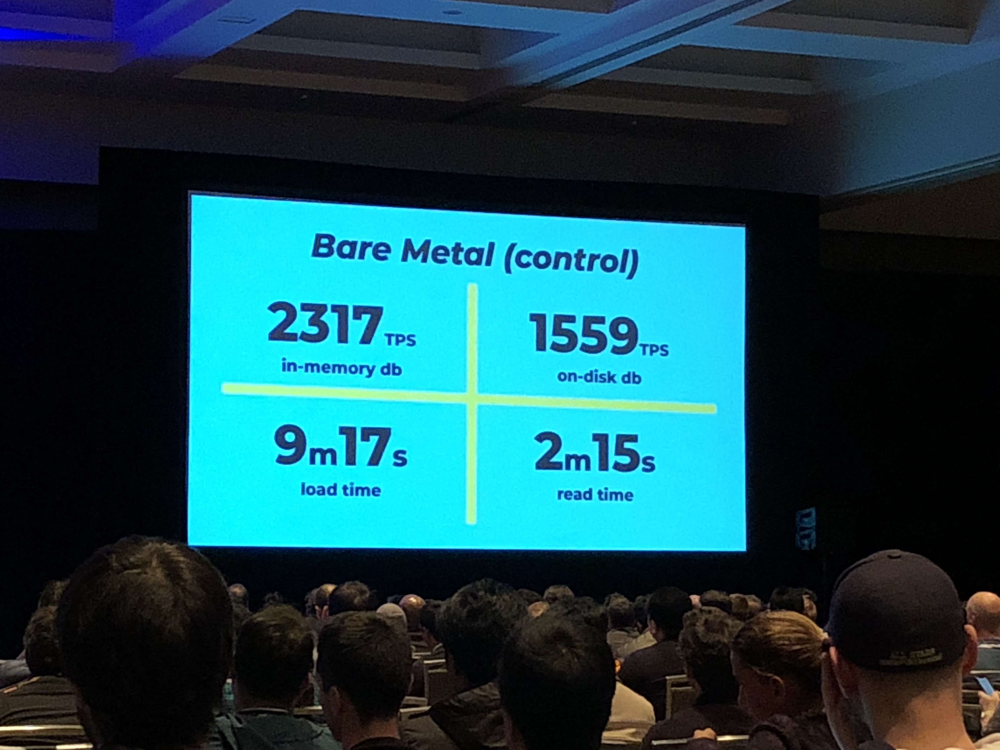
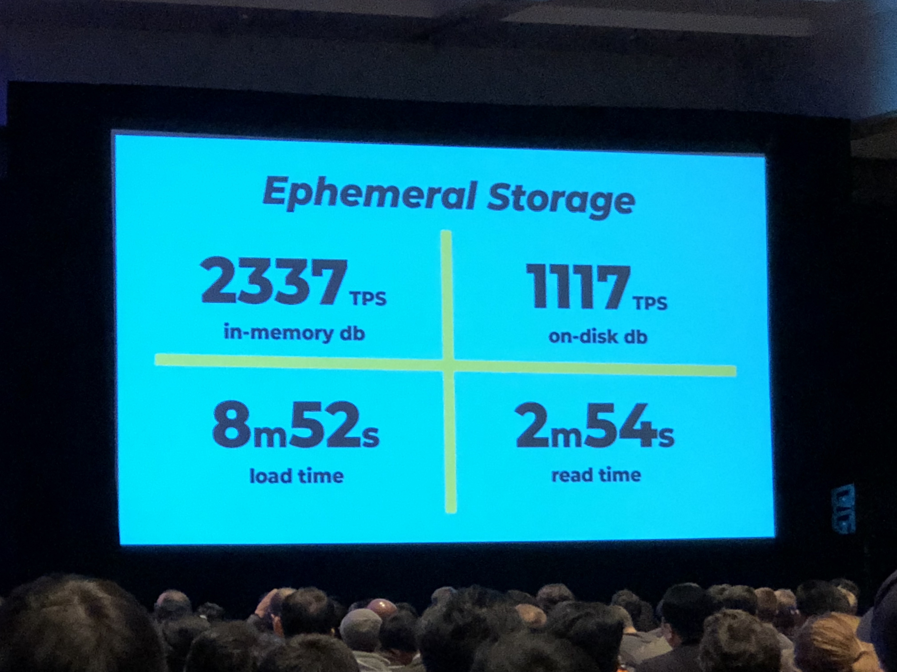
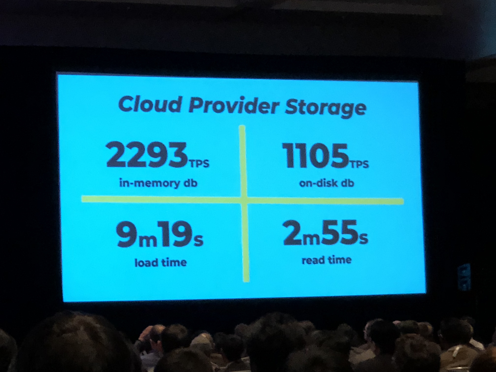
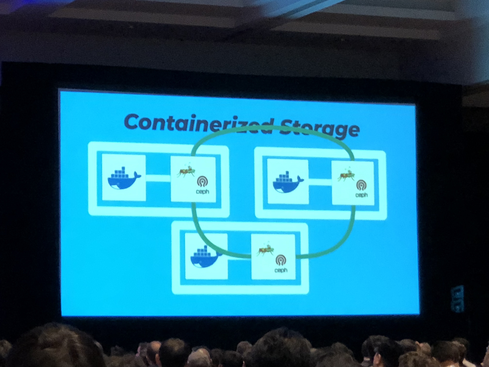
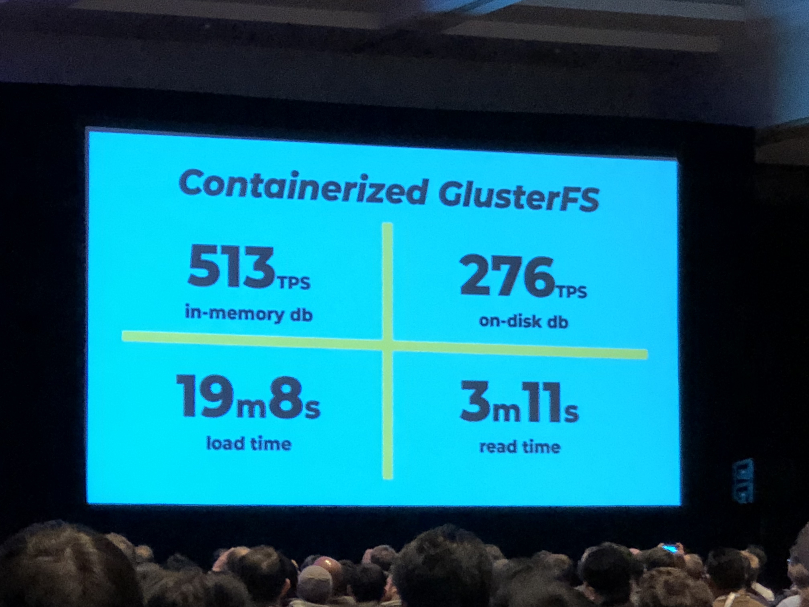
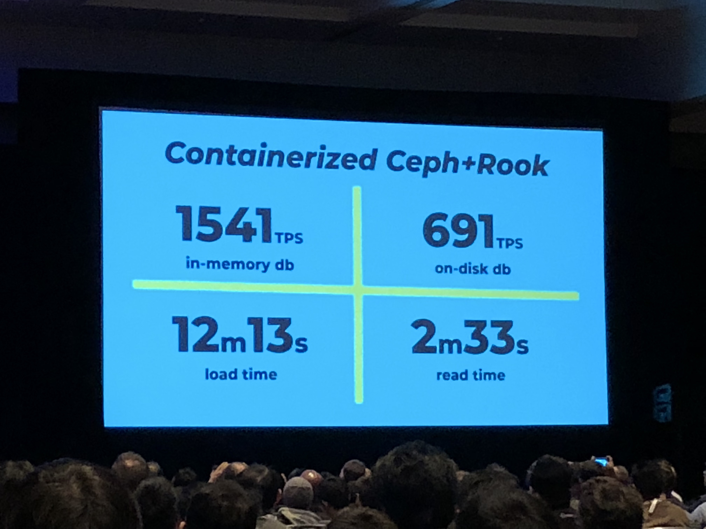
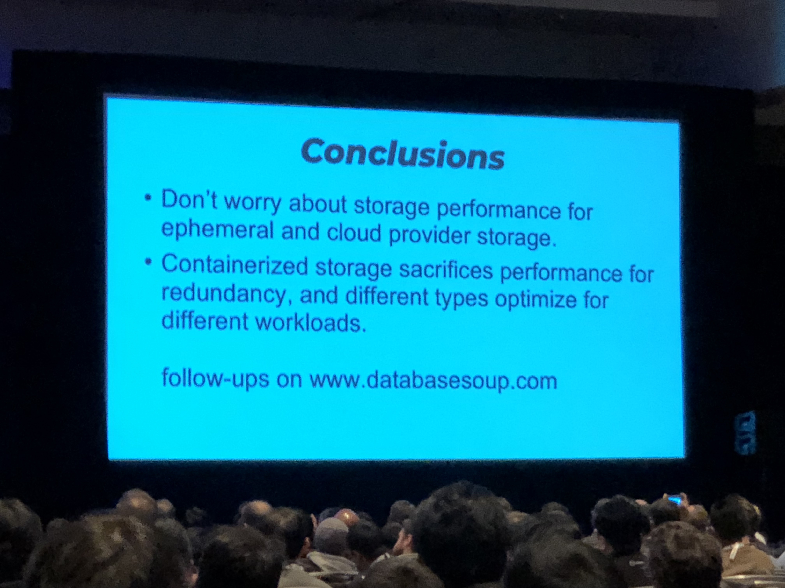

# How fast was my database?
Josh Berkus, Red Hat @fuzzychef

Kubernetes 1.0 came out three years ago, and it was stateless.
Great for a lot of things but databases. 

In 1.4 we got StatefulSets. 

Now we have a lot of stateful stuff in K8s! Tooling around it, too. e.g. Rook

We _can_ run databases on k8s. But _should_ we? 

## Simmple performance test
- 1 in-mem db
- 1 larger-than-mem db
- etc.

## Test stats

```
in memory db            on-disk db


load time               read time
```













